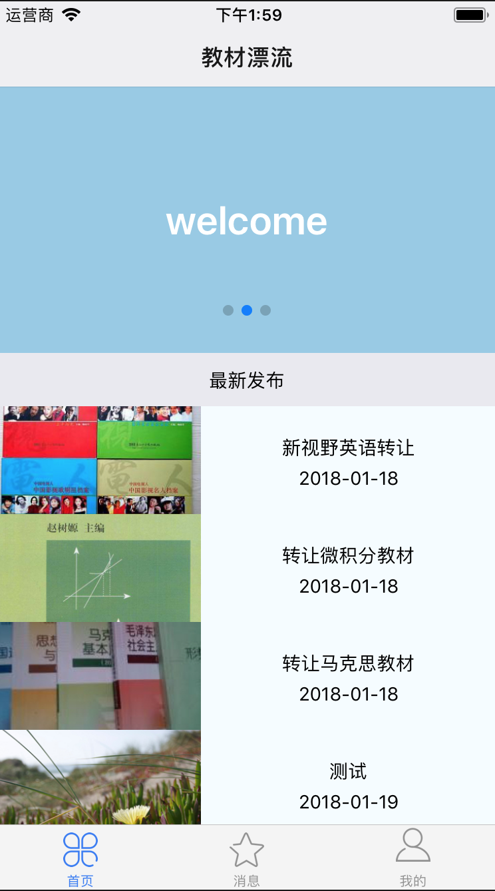
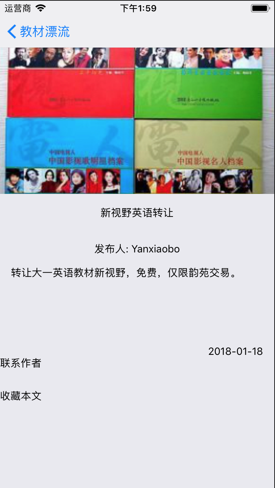
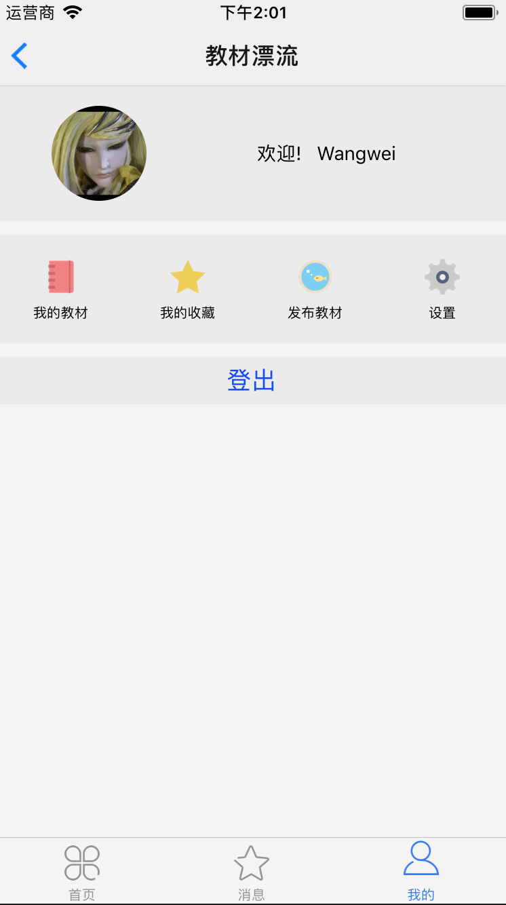

###概要：这是一个为在校大学生提供二手教材交易服务的简单应用，使用的技术主要为React Native +Koa +Mongodb 。

客户端运行方式：

1、cd FloatBook
2、npm install 
3、react-native link
4、react-native run-ios或打开ios目录中的FloatBook.xcodeproj运行

服务端运行方式：

1、cd bookServer
2、npm install
3、node server

功能模块：

运行截图：

主页

详情页

联系作者

消息列表

用户页

登录

